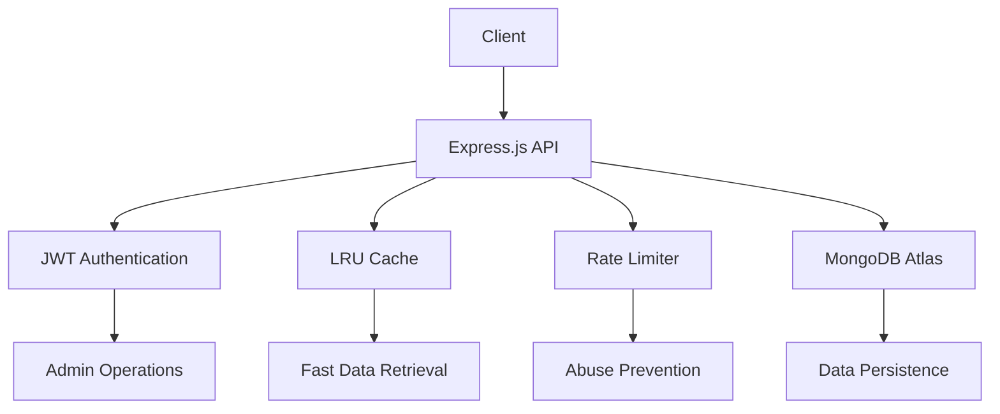

# 🏦 SentinelDataCore
[](https://opensource.org/licenses/MIT)
[](https://nodejs.org/)
[](https://www.mongodb.com/atlas)
[](https://expressjs.com/)
[](https://www.netlify.com/)

> A secure, scalable RESTful API for mock stock market data and financial news—built with Node.js, Express, MongoDB, and JWT authentication.  
> **Now deployable as serverless functions on Netlify!**

**Base URL:** `https://sentineldatacore.netlify.app`

## 🎯 Project Overview

SentinelDataCore provides a robust backend infrastructure for stock trading platforms, analytics dashboards, and financial research tools. It simulates real-time stock data and news feeds, enabling rapid development and testing without the need for costly third-party APIs.

## 🚀 Use Cases

- **Frontend/Fullstack Developers**: Building trading dashboards or portfolio management tools
- **Data Scientists**: Prototyping investment models with realistic mock data
- **Hackathons**: Rapid prototyping for fintech ideas and applications
- **Education**: Teaching RESTful API design, authentication, and system architecture

## ✨ Features

- 🔐 **JWT-based Authentication** - Secure admin access for data modification
- 📊 **Full CRUD Operations** - Complete stock and news management (single or bulk)
- ⚡ **LRU Caching** - Lightning-fast GET endpoints with intelligent caching
- ☁️ **MongoDB Atlas** - Cloud-based data persistence and scalability
- 🛡️ **Rate Limiting** - Built-in protection against abuse and DDoS
- 🏗️ **Modular Architecture** - Clean, maintainable codebase structure
- 📈 **Bulk Operations** - Efficient data seeding and testing capabilities
- 🌐 **Serverless Deployment** - Deploy to Netlify Functions for auto-scaling

## 📁 Project Structure

```
SentinelDataCore/
├── 📁 config/
│   └── db.js                # MongoDB connection setup
├── 📁 controllers/          # Business logic for each resource
│   ├── authController.js
│   ├── newsController.js
│   └── stockController.js
├── 📁 middleware/
│   ├── authMiddleware.js    # JWT verification
│   └── cacheMiddleware.js   # LRU cache for GET endpoints
├── 📁 models/               # Mongoose schemas
│   ├── News.js
│   ├── Stock.js
│   └── User.js
├── 📁 routes/               # Express route definitions
│   ├── authRoutes.js
│   ├── newsRoutes.js
│   └── stockRoutes.js
├── 📁 functions/            # Netlify serverless functions
│   └── api.js               # Express API (serverless handler)
├── 📄 .env                  # Environment variables (never commit!)
├── 📄 .gitignore
├── 📄 cleardata.js          # Script to clear all stocks/news
├── 📄 package.json
├── 📄 seedAdmin.js          # Script to seed the admin user
├── 📄 netlify.toml          # Netlify configuration
└── 📄 server.js             # Main Express app entry point (for local)
```

## 🏗️ System Architecture



**Tech Stack:**
- **Express.js**: Handles routing and middleware
- **MongoDB Atlas**: Scalable, cloud-based database
- **Mongoose**: Schema and model management
- **JWT**: Secures admin actions (add, update, delete)
- **LRU Cache**: Optimizes GET requests, reduces DB load
- **Rate Limiting**: Prevents abuse and accidental DDoS
- **Netlify Functions**: Serverless API deployment

## 📚 API Documentation

### 🔐 Authentication

| Method | Endpoint          | Description               | Auth Required |
| ------ | ----------------- | ------------------------- | ------------- |
| `POST` | `/api/auth/login` | Admin login (returns JWT) | ❌            |

### 📈 Stocks

| Method   | Endpoint              | Description             | Auth Required |
| -------- | --------------------- | ----------------------- | ------------- |
| `GET`    | `/api/stocks`         | Get all stocks          | ❌            |
| `GET`    | `/api/stocks/:symbol` | Get stock by symbol     | ❌            |
| `POST`   | `/api/stocks`         | Add one/multiple stocks | ✅            |
| `PUT`    | `/api/stocks/:symbol` | Update stock by symbol  | ✅            |
| `DELETE` | `/api/stocks/:symbol` | Delete stock by symbol  | ✅            |

### 📰 News

| Method   | Endpoint                    | Description                    | Auth Required |
| -------- | --------------------------- | ------------------------------ | ------------- |
| `GET`    | `/api/news`                 | Get all news articles          | ❌            |
| `GET`    | `/api/news/:id`             | Get news article by ID         | ❌            |
| `GET`    | `/api/news/related/:symbol` | Get all news for a stock symbol| ❌            |
| `POST`   | `/api/news`                 | Add one/multiple news articles | ✅            |
| `PUT`    | `/api/news/:id`             | Update news article by ID      | ✅            |
| `DELETE` | `/api/news/:id`             | Delete news article by ID      | ✅            |

### 🔑 Authentication Flow

1. **Public Access**: All `GET` endpoints are publicly accessible
2. **Admin Access**: Only seeded admin can perform modifications
3. **JWT Token**: Required for all `POST`, `PUT`, and `DELETE` operations

To perform admin actions:
1. Login at `/api/auth/login` with your credentials
2. Use the returned JWT token in the `Authorization: Bearer <token>` header

## 🛠️ Setup & How to Run Locally

### Prerequisites
- Node.js 18+
- MongoDB Atlas account
- Git

### Installation Steps

1. **Clone the repository**
   ```bash
   git clone https://github.com/Shaktiprasadram22/SentinelDataCore.git
   cd SentinelDataCore
   ```

2. **Install dependencies**
   ```bash
   npm install
   ```

3. **Environment Configuration**
   Create a `.env` file in the root directory:
   ```env
   MONGO_URI=your_mongodb_atlas_connection_string
   JWT_SECRET=your_super_secret_jwt_key
   PORT=5000
   ```

4. **Seed Admin User**
   Edit `seedAdmin.js` with your desired admin credentials, then run:
   ```bash
   node seedAdmin.js
   ```

5. **Start the Server Locally**
   ```bash
   # Development mode
   npm run dev
   # Production mode
   npm start
   ```

6. **Optional: Clear Data**
   ```bash
   node cleardata.js
   ```

## 🌐 Deploying to Netlify

### Step-by-Step Deployment

1. **Prepare Serverless Handler**
   - Place your Express API handler in `functions/api.js`
   - Add a `netlify.toml` file in your project root

2. **Deploy to Netlify**
   - Push your code to GitHub
   - Connect your repository to Netlify
   - Set environment variables in Netlify dashboard

3. **Configure Environment Variables**
   In your Netlify dashboard, go to **Site settings > Environment variables** and add:
   ```
   MONGO_URI=your_mongodb_atlas_connection_string
   JWT_SECRET=your_super_secret_jwt_key
   ```

4. **Netlify Auto-Deploy**
   - Netlify will automatically deploy your API as serverless functions
   - Your API will be available at `https://<your-site-name>.netlify.app/api/*`

### 📁 Netlify Configuration (netlify.toml)

Your `netlify.toml` should look like this:

```toml
[build]
  functions = "functions"

[[redirects]]
  from = "/api/*"
  to = "/.netlify/functions/api/:splat"
  status = 200
  force = true
```

**What this does:**
- All requests to `/api/*` are routed to your Express handler in `functions/api.js`
- **Example**: `/api/news` → returns all news from your DB
- **Example**: `/api/stocks` → returns all stocks from your DB

### 🔐 Environment Variables

Set these in your Netlify dashboard (never in your code!):
```env
MONGO_URI=your_mongodb_atlas_connection_string
JWT_SECRET=your_super_secret_jwt_key
```

## 🔧 Configuration

### Admin User Setup
1. Edit `seedAdmin.js` to set your admin username and password
2. Run the script to create or update the admin user in your database
3. The system prevents public registration for security

### Mock Data Loading
- **Stocks**: Bulk upload using `/api/stocks` with a JSON array
- **News**: Bulk upload using `/api/news` with a JSON array

## 🔒 Security Features

### Rate Limiting
Global rate limiting prevents abuse:
```javascript
const rateLimit = require("express-rate-limit");
const limiter = rateLimit({
  windowMs: 15 * 60 * 1000, // 15 minutes
  max: 100, // limit each IP to 100 requests per windowMs
});
app.use(limiter);
```

### Security Best Practices
- ✅ No public registration (admin-only access)
- ✅ Environment variables for sensitive data
- ✅ JWT token-based authentication
- ✅ Password hashing with bcrypt
- ✅ Input validation and sanitization

## ⚡ Performance & Scaling

- **High Concurrency**: Handles thousands of concurrent users via Node.js async model
- **Intelligent Caching**: LRU cache reduces database load
- **Horizontal Scaling**: Ready for multiple Node.js processes/containers
- **Cloud Database**: MongoDB Atlas enables automatic scaling and reliability
- **Serverless Auto-Scaling**: Netlify Functions automatically scale with traffic

## 📋 Example Usage

### Get All Stocks
**Request:** `GET /api/stocks`

**Response:**
```json
[
  {
    "symbol": "RELIANCE.NS",
    "sector": "Nifty Oil & Gas",
    "lastPrice": 2850.10,
    "volume": 950000,
    "resistance": 2900,
    "support": 2800
  }
]
```

### Get Stock by Symbol
**Request:** `GET /api/stocks/RELIANCE.NS`

**Response:**
```json
{
  "symbol": "RELIANCE.NS",
  "sector": "Nifty Oil & Gas",
  "lastPrice": 2850.10,
  "volume": 950000,
  "resistance": 2900,
  "support": 2800
}
```

### Get All News
**Request:** `GET /api/news`

**Response:**
```json
[
  {
    "_id": "abc123",
    "headline": "Reliance launches new green energy project",
    "content": "Reliance Industries announced...",
    "relatedStocks": ["RELIANCE.NS"]
  }
]
```

### Get News by ID
**Request:** `GET /api/news/60c9e0b8e1d2f2a5b4e5d6c7`

**Response:**
```json
{
  "_id": "60c9e0b8e1d2f2a5b4e5d6c7",
  "headline": "Reliance launches new green energy project",
  "content": "Reliance Industries announced...",
  "relatedStocks": ["RELIANCE.NS"]
}
```

### Get News by Related Stock Symbol
**Request:** `GET /api/news/related/RELIANCE.NS`

**Response:**
```json
[
  {
    "_id": "abc123",
    "headline": "Reliance launches new green energy project",
    "content": "Reliance Industries announced...",
    "relatedStocks": ["RELIANCE.NS"]
  }
]
```

### Authentication Example

**Login Request:**
```bash
POST /api/auth/login
Content-Type: application/json

{
  "username": "your_admin_username",
  "password": "your_admin_password"
}
```

**Response:**
```json
{
  "token": "your_jwt_token"
}
```

### Local Development
```bash
# Login and Get JWT Token
POST http://localhost:5000/api/auth/login
Content-Type: application/json
{
  "username": "your_admin_username",
  "password": "your_admin_password"
}
```

### Production (Netlify)
```bash
# Get all news
GET https://sentineldatacore.netlify.app/api/news

# Get all stocks
GET https://sentineldatacore.netlify.app/api/stocks

# Get single stock
GET https://sentineldatacore.netlify.app/api/stocks/RELIANCE.NS
```

### Add Stock Data
```bash
POST https://sentineldatacore.netlify.app/api/stocks
Authorization: Bearer <your_jwt_token>
Content-Type: application/json

[
  {
    "symbol": "RELIANCE.NS",
    "sector": "Nifty Oil & Gas",
    "lastPrice": 2850.10,
    "volume": 950000,
    "resistance": 2900,
    "support": 2800
  }
]
```

## 🚨 Error Handling

- **404 Not Found**: Returned if a stock or news item does not exist
  ```json
  {
    "message": "Stock not found"
  }
  ```

- **401 Unauthorized**: Returned if JWT is missing or invalid for protected endpoints

## 🏗️ Deployment Notes

- All endpoints are available at `/api/...` thanks to Netlify's `netlify.toml` redirect
- Set your MongoDB and JWT secrets as environment variables in Netlify
- **Express.js** (serverless via Netlify Functions)
- **MongoDB Atlas** (cloud database)
- **Mongoose** (schema management)
- **JWT** (admin authentication)
- **Rate limiting & CORS** (security and cross-origin support)

## 🤝 Contributing

Contributions are welcome! Here's how you can help:

1. **Fork** the repository
2. **Create** a feature branch (`git checkout -b feature/amazing-feature`)
3. **Commit** your changes (`git commit -m 'Add some amazing feature'`)
4. **Push** to the branch (`git push origin feature/amazing-feature`)
5. **Open** a Pull Request

## 📝 License

This project is licensed under the MIT License. See the [LICENSE](LICENSE) file for details.

## 🙏 Acknowledgments

- Built for learning, prototyping, and powering the next generation of trading and analytics apps
- Inspired by the need for accessible mock financial data APIs
- Thanks to all contributors and the open-source community

## 📞 Support

For questions, issues, or feature requests:
- 🐛 [Open an issue](https://github.com/Shaktiprasadram22/SentinelDataCore/issues)
- 💬 [Start a discussion](https://github.com/Shaktiprasadram22/SentinelDataCore/discussions)
- 📧 [GitHub Repo](https://github.com/Shaktiprasadram22/SentinelDataCore)

*For advanced usage, admin endpoints, or a downloadable Postman collection, just ask!*

## ⚠️ Security Reminder

> **Important**: Never store admin credentials in `.env` or source code. Use `seedAdmin.js` to securely create or update your admin user.

> **For Netlify**: Set all environment variables in the Netlify dashboard, never in your code repository.

---

Built with ❤️ by **Shaktiprasad Ram**

⭐ Star this repo if you found it helpful!

**SentinelDataCore** is built for learning, prototyping, and powering the next generation of trading and analytics apps.
